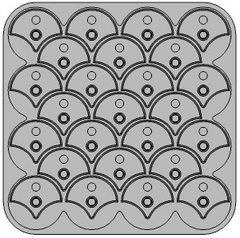

# Ginkgo Puzzle Enumeration

Calculates the number of valid board layouts in the 25-piece Ginkgo Puzzle, by enumerating all possible puzzle layouts and skipping ones that have overlapping pieces or that contain mutually-dependent loops. NOTE: This program took about 18 hours to run to completion on a PC with 16GB ram and an Intel Core i7 2.8GHz processor. This is my first Python program in a long time, and I have not made much of an attempt to optimize it.

I created a 3D printable combination puzzle I call the Ginkgo Puzzle. The 3D printable version is at [Cults3D: Ginkgo Combination Puzzle](https://cults3d.com/en/3d-model/game/ginkgo-combination-puzzle). Once I created the puzzle, I immediately wondered how many unique board positions there are, and whether that number is small enough to allow a brute-force analysis of questions such as "Is it possible to get from any arbitrary board layout to any other via legal moves?"

The upshot: This program originally said there are 3,625,093,120 unique, valid board layouts. That number seems far too large for me to naively create a matrix of board positions and arcs between them that represent valid moves.

There are far fewer board layouts that can be achieved by rotating pieces from the starting layout (all pieces pointing North).

Files:
- Diary.odt = A LibreOffice diary of the project.
- Enumeration.py = A Python 3 program to enumerate the number of valid boards.
- FullRunProfilingResult.txt = The tail of the output of the program's complete run.
- GinkgoBoard.jpg = An example board layout, where all pieces point South.
- ImpossibleLayout.jpg = An example of an invalid board layout, containing loops.
- LICENSE = the license I've attached to this program.
- Loops.jpg = an illustration of the two possible loops a North-pointing piece can be part of.
- README.md = this file
- SpiralPattern.odp = A LibreOffice diagram of the board coordinates, loop examples, and the spiral pattern of placing pieces that this program uses.
